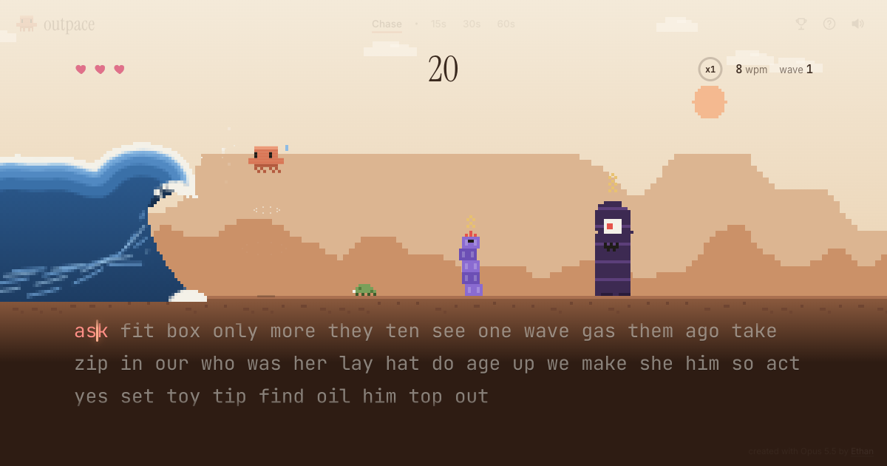
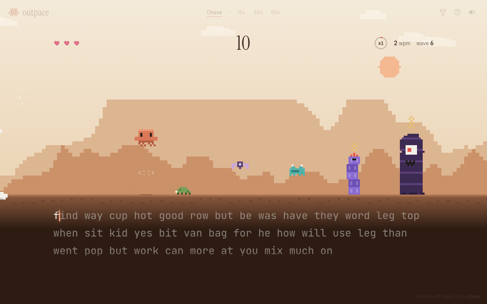
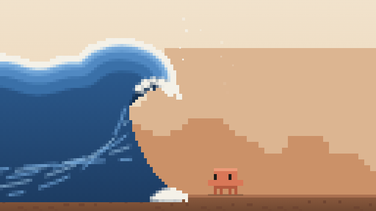
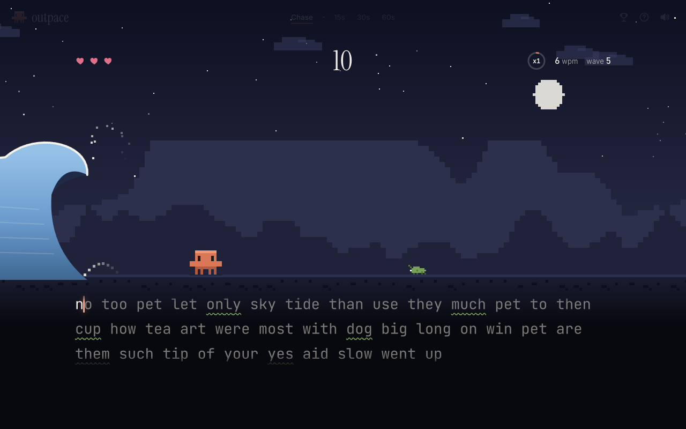
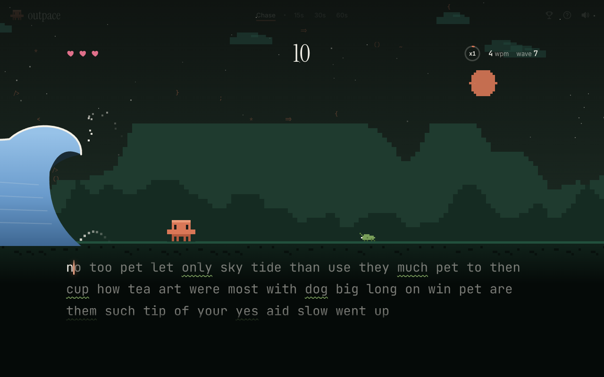
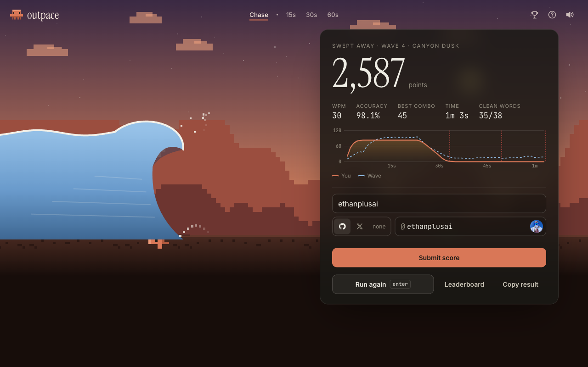
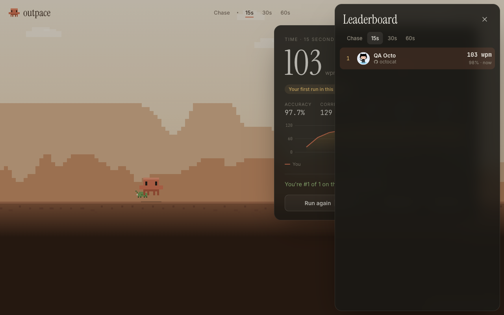

# Outpace

**A typing game where you type to keep Claude running ahead of a wave.**
Play it at **[outpace.ethanplus.ai](https://outpace.ethanplus.ai)**.



> **This project is a test of Claude Opus 5.5.** The whole thing (game design, engine, pixel art, backend, tests, security pass and deployment) was built by Opus 5.5 in Claude Code in one session of about 45 minutes. It started from a single prompt. The human part was the brief and four mid-build redirections from [Ethan](https://x.com/ethanplusai): "make it a runner with the Claude mascot", "make the whole page the landscape", "the wave can be much better", and "space should jump, and creatures should come at you". Opus 5.5 orchestrated the work and sent two well-scoped tasks to Sonnet 5.5 subagents (building the backend and adversarial security QA). The full timeline, token usage and every iteration are in [docs/BUILD_LOG.md](docs/BUILD_LOG.md).

## How to play

- **Type to run.** Every correct letter carries Claude forward, and words move on by themselves.
- **Space jumps.** Press it again in the air for a double or triple jump. On a phone, tap the sky.
- **Creatures come at you**, whether you're typing or not:

  | Creature | How to beat it | Damage |
  | --- | --- | --- |
  | Beetle | Jump, or land on it to stomp it | ½ heart |
  | Moth | Flies at head height, so don't jump | ½ heart |
  | Hopper | Bounces, so time your jump | ½ heart |
  | Code Stack | Double jump | 1 heart |
  | Glitch Giant | Triple jump | 1½ hearts |

- **Outrun the wave.** It measures your typing speed and keeps pace, pushing harder as you improve. Getting caught costs a heart.
- **Golden words** push the wave back. **Heart words** heal. Type 25 letters in a row without a mistake to raise your multiplier, up to x8.
- A new wave every 20 seconds brings harder words and new creatures, and the scenery changes every two waves.
- **Sprint mode** (15, 30 or 60 seconds) is a plain typing test with nothing chasing you.

Scores go to a global leaderboard. You can attach a GitHub or X username to show your avatar and link your profile. There are no accounts and no sign-in.

## Screenshots

| | |
| --- | --- |
|  |  |
|  |  |
|  |  |

## Run it locally

```bash
git clone https://github.com/ethanplusai/outpace.git
cd outpace
npm start        # http://localhost:4173, no install step, no dependencies
npm test         # 47 tests: engine rules, score validation, API
npm run sim      # balance: typing-and-jumping bots from 25 to 130 wpm
npm run feasibility   # proves every creature is beatable and measures the timing window
```

Needs Node 18 or newer. There are **zero npm dependencies**. Locally, scores are saved to `data/scores.json`.

## How it's built

```
public/js/engine.js    all game rules as pure logic with time passed in: typing, adaptive wave,
                       jump physics, creatures, health, scoring. Fully unit tested.
public/js/scene.js     canvas world: parallax biomes, Claude sprite, creatures, and a pixel
                       "Great Wave" rendered at 1/u resolution with hard edges
public/js/app.js       input (keyboard, mobile IME, tap-to-jump), HUD, results, leaderboard UI
server/api.js          transport-agnostic API: HMAC run tokens, plausibility checks, rate limits
server/store.js        local JSON-file store
server/redis-store.js  Upstash Redis store over REST (atomic best-score updates in Lua)
server/server.js       local Node server (static files + API)
api/*.js               Vercel functions, thin wrappers around server/api.js
```

A few design decisions worth knowing:

- **Space never types.** It only jumps, and words advance on their own. A mistimed jump costs you time and rhythm, never accuracy.
- **Difficulty is time-based.** Waves come every 20 seconds, whatever your speed. In simulation, runs last about 2 minutes at every skill level, and score scales with skill.
- **The engine is authoritative.** The renderer reads Claude's position and height from the engine, so what you see is exactly what collides.
- **The leaderboard is honest about its limits.** Without accounts, stats come from the client. The server rejects impossible runs (level vs. time, WPM vs. characters, accuracy vs. errors, single-use signed run tokens, rate limits), but it can't prove a plausible score was really played.

## Deploy your own

It's set up for Vercel: static files from `public/`, plus functions in `api/`.

1. Import the repo into Vercel.
2. Add an **Upstash for Redis** store from the Vercel Marketplace. It sets `KV_REST_API_URL` and `KV_REST_API_TOKEN`.
3. Set `OUTPACE_SECRET` to a long random string. It signs the run tokens.

You can also run `node server/server.js` on any host with a persistent disk (set `DATA_DIR`).

## Credits and license

Built by Claude Opus 5.5 at the direction of [Ethan](https://x.com/ethanplusai). MIT licensed, see [LICENSE](LICENSE).

This is a fan-made project. It is not affiliated with or endorsed by Anthropic. Claude and the Claude mascot are Anthropic's.
